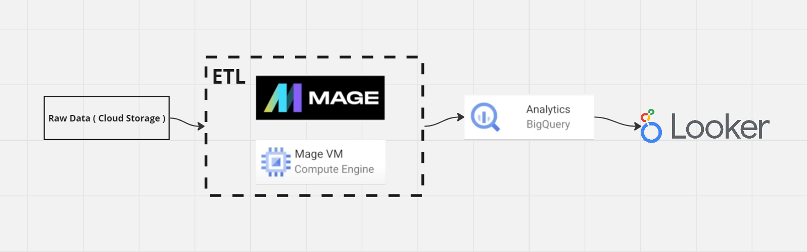

# Uber-Data-Analytics-End-To-End-Data-Engineering-Project

 

## Overview

This repository contains the code and documentation for analyzing Uber data using various tools and technologies, including Google Cloud Platform (GCP) Storage, Python, Compute Instance, Mage Data Pipeline Tool, BigQuery, and Looker Studio. The purpose of this project is to gain valuable insights from Uber data to make informed decisions and drive business strategies.

## Uber Data Model

## Tools and Technologies Used

### 1. Google Cloud Platform (GCP) Storage

- **Purpose**: GCP Storage is used for storing large datasets securely in the cloud.
- **Usage**: We will upload and manage Uber data files in GCP Storage.

### 2. Python

- **Purpose**: Python is a versatile programming language that is used for data manipulation, analysis, and visualization.
- **Usage**: We will write Python scripts to preprocess, analyze, and visualize Uber data.

### 3. Compute Instance

- **Purpose**: Compute instances provide scalable and reliable computing power on the cloud.
- **Usage**: We will utilize Compute Instances to run data processing and analysis tasks efficiently.

### 4. Mage Data Pipeline Tool

- **Purpose**: Mage is a data pipeline tool that helps automate and orchestrate data workflows.
- **Usage**: We will use Mage to create data pipelines for ingesting and processing Uber data.

### 5. BigQuery

- **Purpose**: BigQuery is a fully managed, serverless data warehouse for running fast and SQL-like queries.
- **Usage**: We will load Uber data into BigQuery tables for advanced querying and analysis.

### 6. Looker Studio

- **Purpose**: Looker Studio is a business intelligence and data visualization tool.
- **Usage**: We will create interactive dashboards and reports in Looker Studio to visualize the results of our analysis.

## Getting Started

To get started with this project, follow these steps:

1. **Clone the Repository**: Clone this repository to your local machine using the following command:

git clone https://github.com/Youssra1999/uber-data-analysis.git 

2. **Set Up GCP**: If you haven't already, create a Google Cloud Platform (GCP) account and set up a project. Configure GCP Storage and BigQuery for your project.

3. **Install Dependencies**: Install the necessary Python libraries and dependencies by running:

4. **Configure Mage Data Pipeline**: Set up and configure Mage for your data pipelines. Refer to the `mage_config.yaml` file for configuration details.

5. **Upload Data to GCP Storage**: Upload the Uber data files to your GCP Storage bucket.

6. **Run Data Pipelines**: Execute Mage data pipelines to ingest and preprocess the Uber data.

7. **Load Data into BigQuery**: Load the preprocessed data into BigQuery tables for analysis.

8. **Run Analysis Scripts**: Use Python scripts in the `analysis` directory to perform data analysis and generate insights.

9. **Create Looker Dashboards**: Design interactive dashboards and reports in Looker Studio to visualize the results of your analysis.

## Project Structure

The project directory structure is organized as follows:

- `data`: Contains the Uber data files.
- `mage`: Stores Mage data pipeline configurations.
- `analysis`: Includes Python scripts for data analysis.
- `looker`: Contains Looker Studio dashboard configurations.

## License

This project is licensed under the MIT License - see the [LICENSE](LICENSE) file for details.

## Acknowledgments

Special thanks to the open-source communities and contributors of the tools and technologies used in this project.

Feel free to reach out to the project maintainers for any questions or assistance.

**Happy analyzing!**
